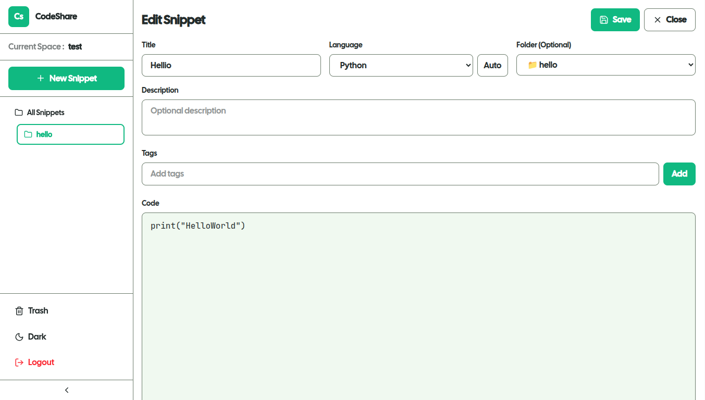

# 🚀 CodeShare

A collaborative code sharing platform built with **Next.js** | **TypeScript** | **Firebase**

---

## Screenshots

 ### Homescreen:
  

  ### Editor:
  |

---

## Quick Start

### Installation
```bash
git clone https://github.com/localhost969/Codeshare.git
cd Codeshare
npm install
```

### Environment Setup

**Required Variables:**
```env
FIREBASE_PROJECT_ID=your_api_key
FIREBASE_PRIVATE_KEY=your_auth_domain
FIREBASE_CLIENT_EMAIL=your_project_id
FIREBASE_DATABASE_URL=your_databse_url
JWT_SECRET=your_secret_key
```

### Run
```bash
npm run dev
```

Visit `http://localhost:3000`

---

## Project Structure

```
codeshare/
├── components/
│   ├── Dashboard/
│   ├── Home/
│   └── UI/
├── pages/
│   ├── api/
│   └── dashboard/
├── lib/
├── public/
├── styles/
└── ...                  # Config files (package.json, tsconfig.json, etc.)
```

---
